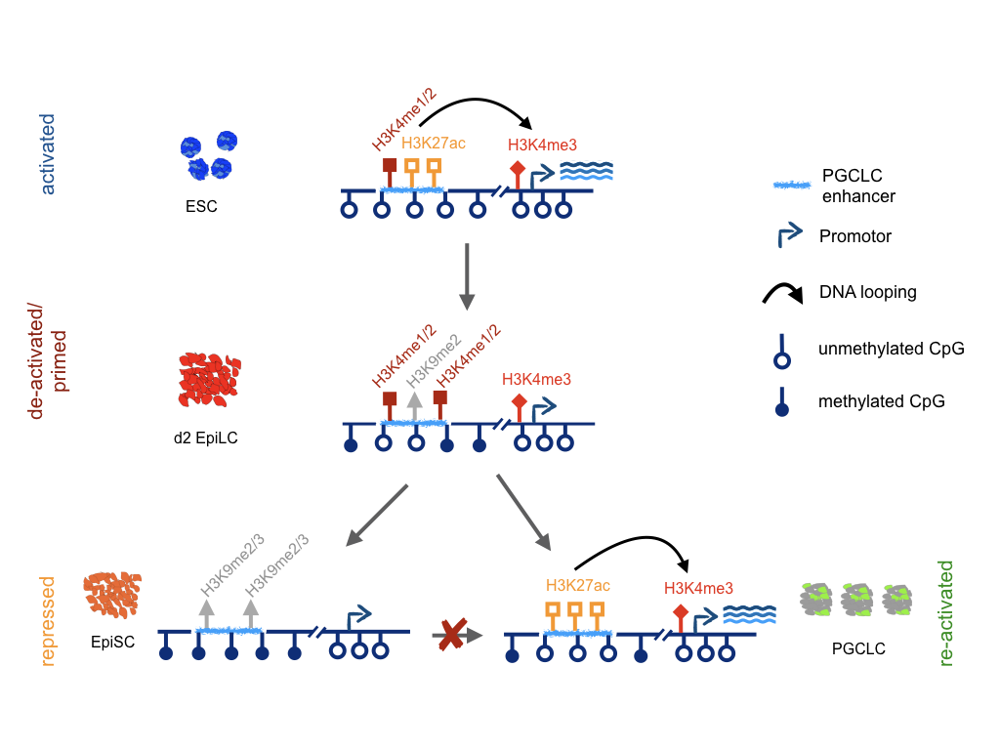

# Enhancer priming by H3K4 methylation safeguards germline competence
 
This repository contains scripts that were used for the investigation of enhancer priming for germline competence: [bioRxiv](https://www.biorxiv.org/content/10.1101/2020.07.07.192427v1)

## Summary
Germline specification in mammals occurs through an inductive process whereby competent cells in the post-implantation epiblast reactivate a naïve pluripotency expression program and differentiate into primordial germ cells (PGC). The intrinsic factors that endow epiblast cells with the competence to respond to germline inductive signals remain largely unknown.  
Here we show that early germline genes that are active in the naïve pluripotent state become homogeneously dismantled in germline competent epiblast cells. In contrast, the enhancers controlling the expression of major PGC genes transiently and heterogeneously acquire a primed state characterized by intermediate DNA methylation, chromatin accessibility, and H3K4me1. This primed enhancer state is lost, together with germline competence, as epiblast cells develop further. Importantly, we demonstrate that priming by H3K4me1/2 enables the robust activation of PGC enhancers and is required for germline competence and specification. Our work suggests that H3K4me1/2 is directly involved in enhancer priming and the acquisition of competence.

## Content
* `/scRNAseq/`: Analysis of the single-cell RNA-seq data of the PGCLC differentiation
* `/PGCLC_enhancer/`: Definition of PGCLC enhancers
* `/Competence/`: Comparative ChIP-seq analysis for germline competence
* `/Heterogeneity/`: Analysis of the DNA methylation heterogeneity using [scNMT data](https://doi.org/10.1038/s41586-019-1825-8)

## Data
All data from the different stages of PGCLC differentiation have been deposited in the [GEO database](https://www.ncbi.nlm.nih.gov/geo/query/acc.cgi?acc=GSE155089) under the follwoing accession numbers:
* [GSE155015 - 4C-seq *Prdm14*](https://www.ncbi.nlm.nih.gov/geo/query/acc.cgi?acc=GSE155015)
* [GSE155058 - ATAC-seq](https://www.ncbi.nlm.nih.gov/geo/query/acc.cgi?acc=GSE155058)
* [GSE155062 - ChIP-seq (Comparision EpiLC vs. EpiSC)](https://www.ncbi.nlm.nih.gov/geo/query/acc.cgi?acc=GSE155062)
* [GSE155069 - ChIP-seq (*Mll3/4 dCD* and *Otx2* KO)](https://www.ncbi.nlm.nih.gov/geo/query/acc.cgi?acc=GSE155069)
* [GSE155079 - bulk RNA-seq](https://www.ncbi.nlm.nih.gov/geo/query/acc.cgi?acc=GSE155079)
* [GSE155083 - Genome-wide DNA methylation](https://www.ncbi.nlm.nih.gov/geo/query/acc.cgi?acc=GSE155083)
* [GSE155088 - scRNA-seq (10x Genomics)](https://www.ncbi.nlm.nih.gov/geo/query/acc.cgi?acc=GSE155088)

## Contact
Álvaro Rada-Iglesias (alvaro.rada@unican.es)  
Tore Bleckwehl (tbleckwe@uni-koeln.de)
